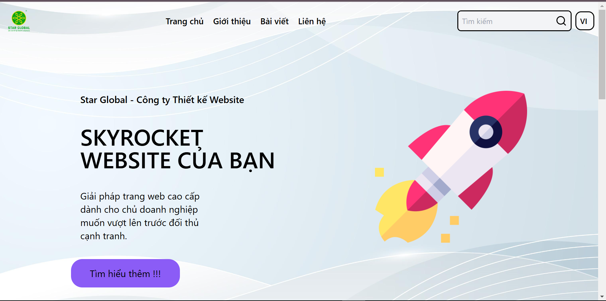
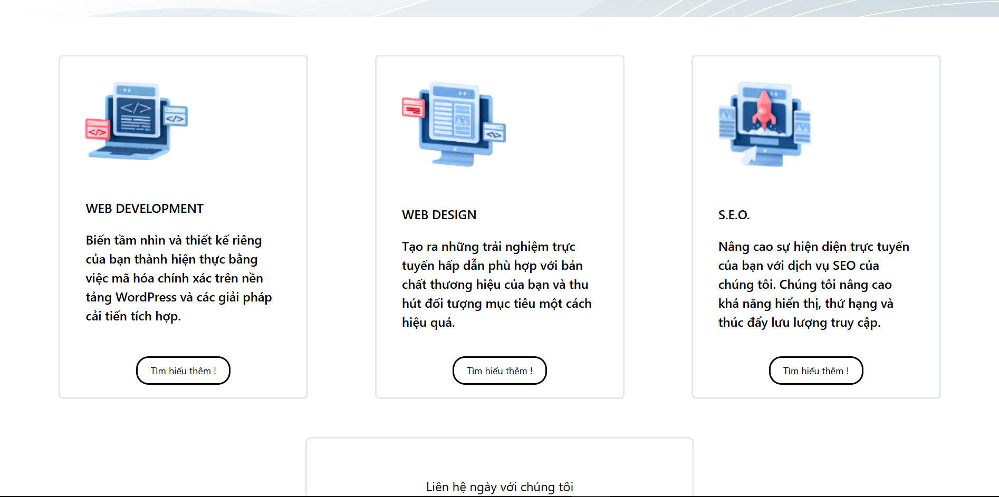
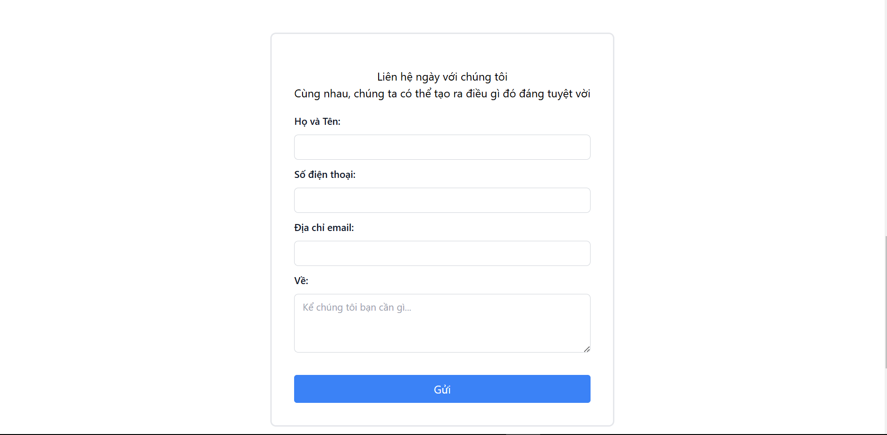
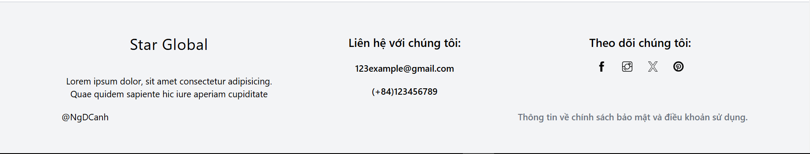
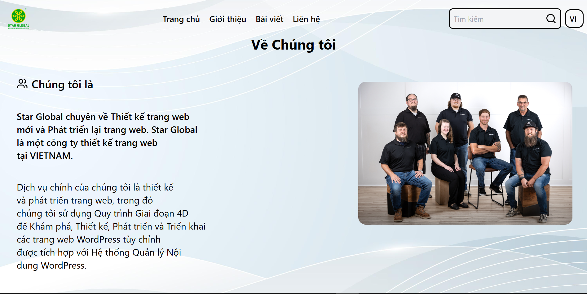
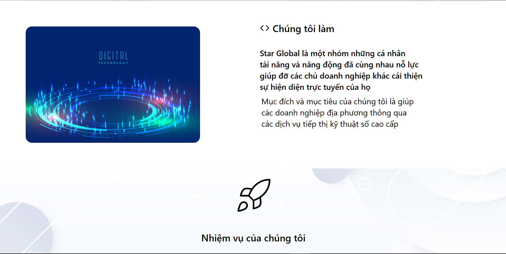
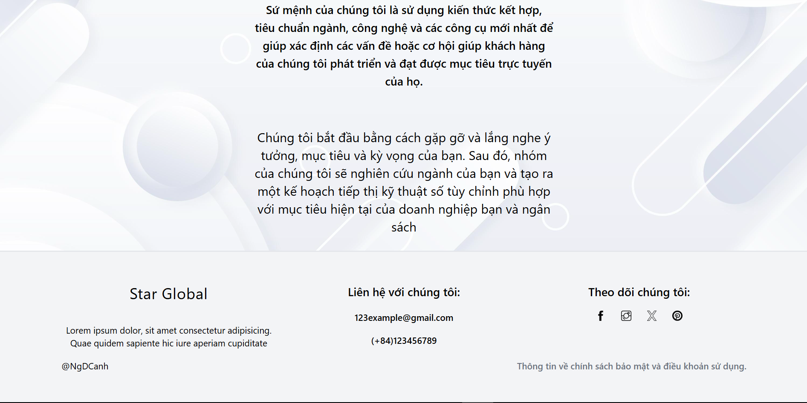

link Demo trang web: https://simple123web.netlify.app/

Tech : React, Vite, Tailwindcss

Libraries: emailjs.com, lucide-react, react-helmet

Các Plugin SEO: react helmet

Giao diện: Hoàn chỉnh 100% từ yêu cầu chung đến yêu cầu chi tiết.
Giao diện Trang chủ:

Hoàn thành các mục từ heading(navbar), hero section, content section, footer.
Giao diện Giới thiệu:

Hoàn thành các mục heading(navbar), content section, footer
Trang chủ(/) và Giới thiệu(/about) đều được liên kết với nhau bởi react-router-dom qua navbar
Các trang đều được responsive ở cả desktop view và mobile view.
Các hiệu ứng được làm đầy đủ và đơn giản.
Các hỉnh ảnh được lấy từ trên web và từ thư viện lucide-react.Được hiển thị rõ nét.
Chức năng chuyển đổi ngôn ngữ được đặt ở phía đầu trang phần heading hiển thị ngôn ngữ đang sử dụng, ví dụ hiện "VI" thì web đang dùng tiếng việt , nếu bấm nào thì sẽ chuyển thành EN là web sẽ sử dụng văn bản tiếng anh. Chức năng sử dụng context để tạo state là language phù hợp cho chức năng đơn giản là đổi ngôn ngữ.
Đã thêm thuộc tính metadata cũng như title,descrition cho web với react-helmet

Cách sử dụng:
git clone dự án về máy và chạy lệnh terminal với "npm i npm run dev".
